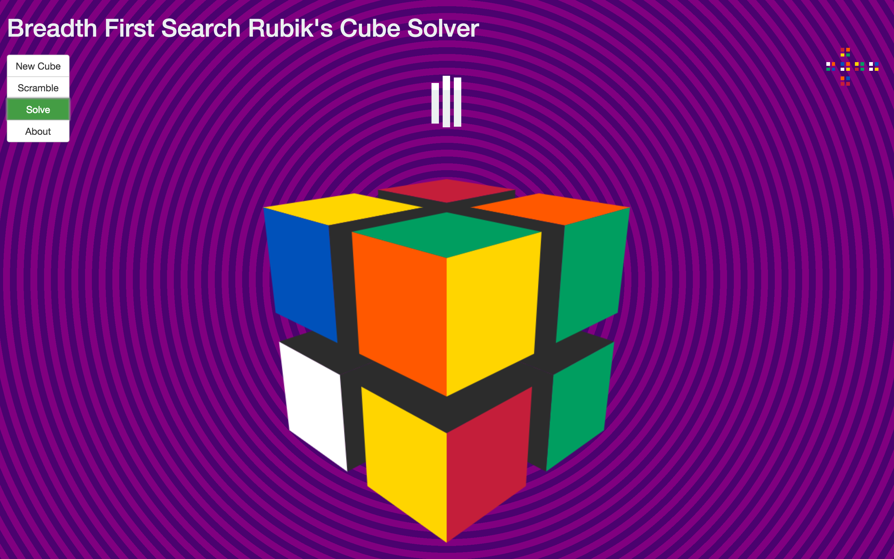
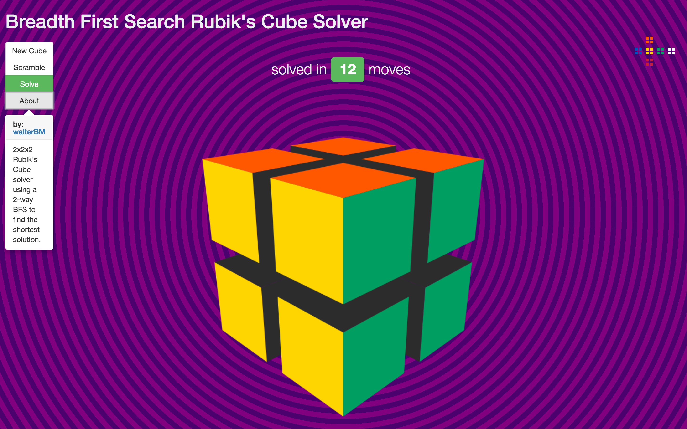

# 2x2x2 BFS Rubik's Cube Solver

## Description

Rails application to visualize and solve a 2×2×2 Rubik’s Cube in the fewest possible twists. The Rubik’s Cube is solved using a Ruby implementation of the two-way Breadth-First Search algorithm and visualized using the JavaScript library [three.js](http://threejs.org/). 

A 2x2x2 Rubik's Cube has [3,674,160](http://www.therubikzone.com/Number-Of-Combinations.html) possible combinations and the application has been optimized to find most solutions in less than 5 seconds.

## Screenshots

Home page for the Rubik Solver app showing the 3D cube created with three.js.

The cube can be randomly shuffled while maintaining geometry like any real-world Rubik's cube.

Uses 2-way BFS to automatically find the shortest number of twists required to solve the Rubik's cube.

## Background

Inspired by MIT's 6.006 "Introduction to Algorithms" class which uses this Rubik's Cube problem to teach [Breadth-First Search](https://www.youtube.com/watch?v=s-CYnVz-uh4) and algorithmic optimization. 

## Features

+ Ruby implementation of the two-way Breadth-First Search algorithm
+ 3D visualization of a Rubik's Cube using three.js

## Development/Contribution

Please feel free to contribute to the project. 

## Future

Maybe in the future I will attempt to create a solver for the classic Rubik's Cube. Turns out the classic Cube is quite a computational challenge. A 3x3x3 Rubik's Cube has over [43 quintillion](http://www.therubikzone.com/Number-Of-Combinations.html) possible combinations and requires [specialized algorithms](https://www.cs.princeton.edu/courses/archive/fall06/cos402/papers/korfrubik.pdf) to reduce the complexity of the problem at the cost of sacrificing optimization. 

## Created by:

- [Walter Beller-Morales](https://github.com/walterbm)

## License

This Rubik's Cube Solver is MIT Licensed. See LICENSE for details.